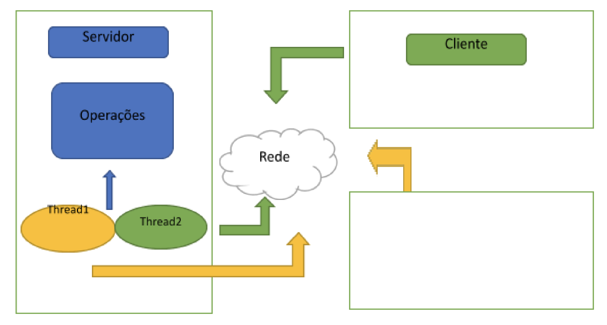

## Prática de Implementação: Sistema Distribuído Simples para Manutenção de Contas Bancárias

Trabalho da disciplina MATA88: Fundamentos de Sistemas Distribuídos - 2022.1

#### Integrantes do grupo:
* Marivaldo Pereira
* Robson Sousa
* Vinicius Brito

### Descrição
Esta é uma implementação rudimentar de um **sistema bancário de transações financeiras** para
saque, aferição de saldo, depósito e transferências entre contas bancárias. Além disso, os processos de clientes e o
servidor mantém seus respectivos relógios lógicos atualizados, iniciando com valor 0.

#### Detalhamento

1. As operações de transações financeiras estão implementadas no servidor, mantendo contas de clientes.
2. Os clientes se conectam ao servidor e solicitam as operações desejadas (enviam requisições), i.e, saque, depósito e etc. Cada cliente possui uma conta corrente vinculada ao seu número de RG.
3. As comunicações foram implementadas usando sockets.

___

### Estrutura do diretório
- *database.py*: representação do DB de Dados do Sistema Bancário.
- *client.py*: representação do Cliente.
- *server.py*: representação do Servidor.
- *db.txt*: DB de dados de clientes e seus respectivos saldos.

### Executando
Para executar o projeto adequadamente, entre na raiz do projeto e execute:
- `python3 server.py` em uma janela do terminal;
- `python3 client.py` em outra(s) janela(s) do terminal. É possível rodar mais de um cliente simultaneamente.

### Funcionalidades
